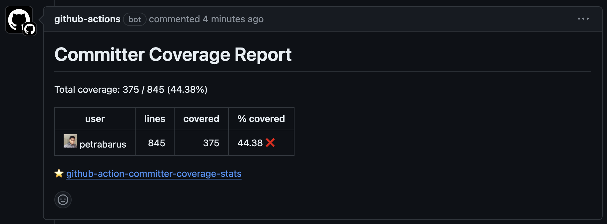

# Committers Code Coverage Stats GitHub Action
Github action to analyze the code coverage of the committers in a repository.

## 1. Inputs

### 1.1 `min_threshold`

The minimum threshold for the committers' code coverage percentage. If the code coverage percentage of a committer is below this threshold, the committer will be considered as a failing committer.

Default: `80`

### 1.2 `coverage_files`

The list of coverage files to be analyzed. The coverage files should be in the format of `path/to/coverage.xml`. Multiple coverage files can be provided by separating them with a comma.
**Note**: At the moment, this only supports Cobertura XML format.

Default: `coverage.xml`

### 1.3. `base`

The base branch to compare the code coverage percentage with. This is useful for getting the summary comparison between the current branch and the base branch rather than all of the history. Optional. 
If not provided, the summary will be calculated for all of the history.

### 1.4. `from_timestamp`

The timestamp to start the code coverage analysis from. This is useful for getting the summary comparison between the current branch and the base branch for a specific time period. Optional.
If not provided, the analysis will start from the beginning of the repository.

Format ISO 8601. Example: `2024-02-20T00:00:00Z`.

### 1.5. `to_timestamp`

The timestamp to end the code coverage analysis at. This is useful for getting the summary comparison between the current branch and the base branch for a specific time period. Optional.
If not provided, the analysis will end at the current timestamp.

Format ISO 8601. Example: `2024-02-20T00:00:00Z`.

## 2. Outputs

This action will post a comment on the pull request with the list of committers and their code coverage percentage.



## 3. Example Usage

You can use this action in your workflow by adding the following step in your workflow file.

```yaml
jobs:
  build:
    runs-on: ubuntu-latest
    # The permissions are required to post a comment on the pull request.
    permissions:
      contents: read
      pull-requests: write
    steps:
    - name: Checkout
      uses: actions/checkout@v4
      with:
        # This is required to get the full git history. Otherwise, the committers' code 
        # coverage will not be accurate.
        fetch-depth: 0
    - name: Generate Coverage
      # This is where you run your tests and generate the coverage files.
      run: |
        echo "Generate Coverage"

    - name: Coverage Stats
      uses: petrabarus/github-action-committer-coverage-stats@main
      with:
        workspace: ${{ github.workspace }}
```

## 4. Roadmap

Some of the features that are planned to be added in the future are:
- [ ] Support for multiple code coverage formats, e.g. lcov, etc.
- [ ] Send data to external services, e.g. Zapier, Slack, etc.
- [ ] File exclusion list for the code coverage analysis.

## 5. License

[BSD 2-Clause License](https://opensource.org/license/bsd-2-clause)